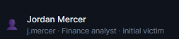
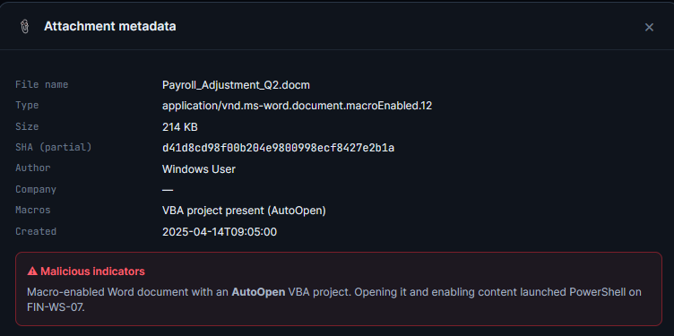
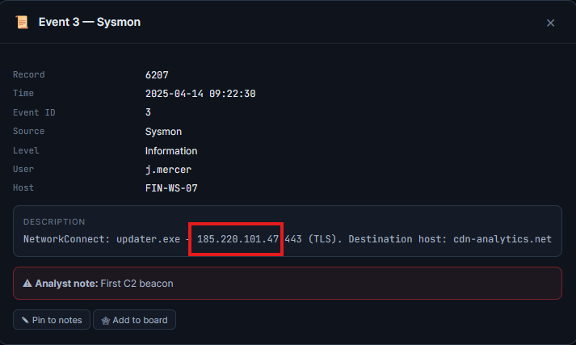
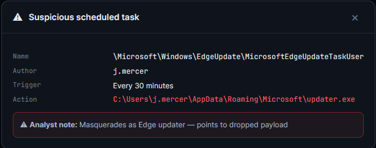
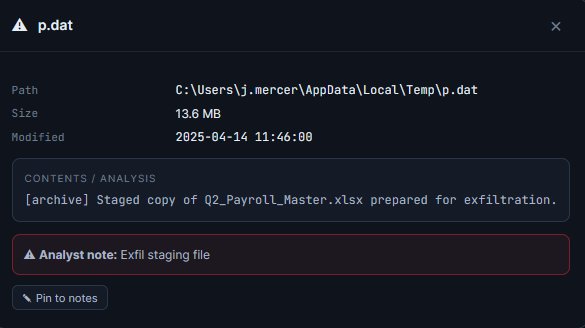
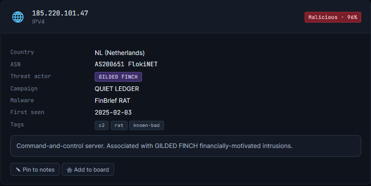

# Level 1: The Phantom Login

## 1. Which user account was the initial victim?
When we first open the scenario, we are met with a wealth of information. Among these is the initial victim, in this case, a user account by the name of **j.mercer** 
  

## 2. What was the name of the malicious email attachment?
By going to the emails in the evidence locker and looking for the one flagged as malicious, we can click on the attached file and see some information about it. This info tells us that **Payroll_Adjustment_Q2.docm** is the file in question.  
  

## 3. What is the command-and-control (C2) IP address?
By navigating to the security event logs part of the evidence locker and sorting by flagged we can see when the first C2 beacon goes out to the IP **185.220.101.47**
  

## 4. What persistence mechanism was established? (name one)
By going to the same section as the previous question, we can identify 2 methods of persistence **the registry RUN key and a scheduled task.**
  

## 5. Which malware family / campaign was identified?
At this point in the scenario, the final artifact, in this case, a memory dump, will be available to you. Looking there spells out that the **RAT** malware family is what we are dealing with on this system.
  

## 6. What sensitive file was exfiltrated?
By utilizing the file system "snapshot" in the evidence locker and taking a quick look around, ultimately navigating to **C:\Users\j.mercer\AppData\Local\Temp\p.dat**, we discover that **Q2_Payroll_Master.xlsx** was staged and exfilltrated by this malware.
  

## 7. Which threat actor is attributed to this intrusion?
A quick search of any of the malicious artifacts located on the machine in their built-in VirusTotal (Threat Intelligence) reveals **GILDED FINCH** to be behind this attack.
  
