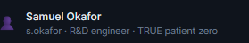
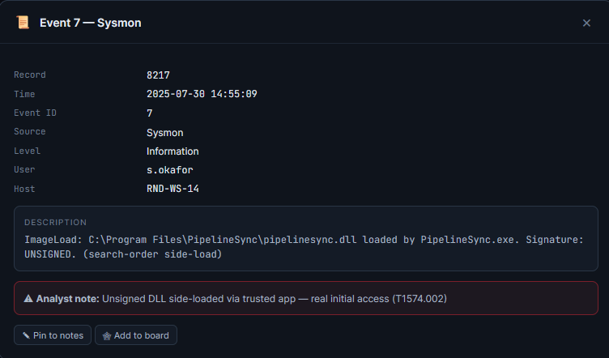
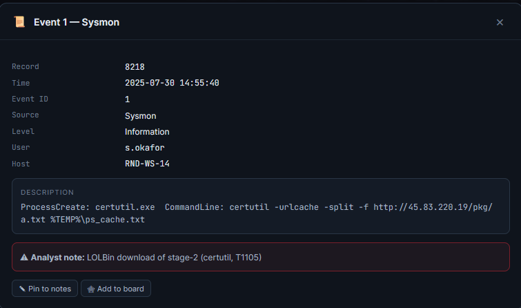
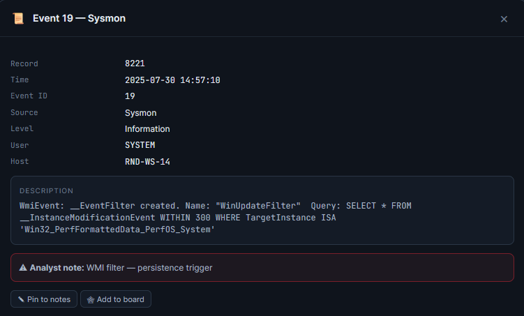
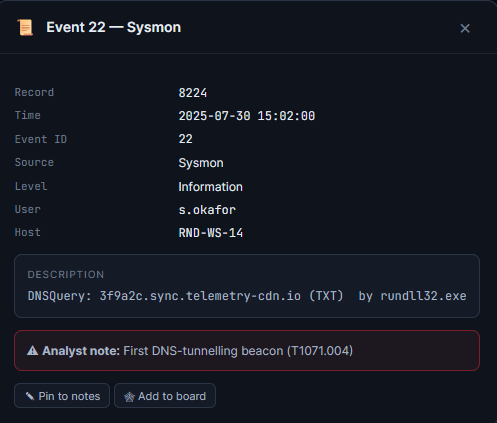
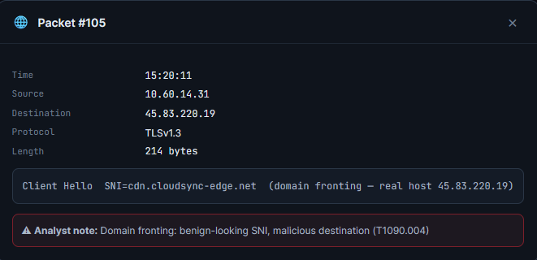
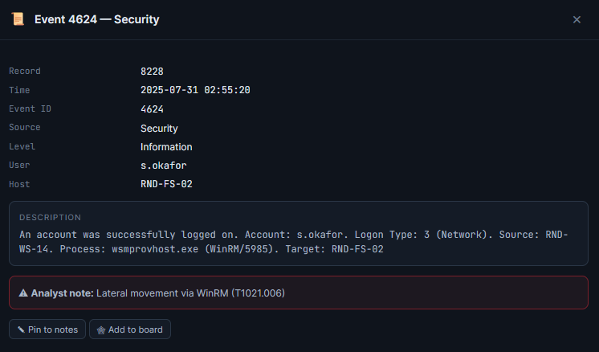
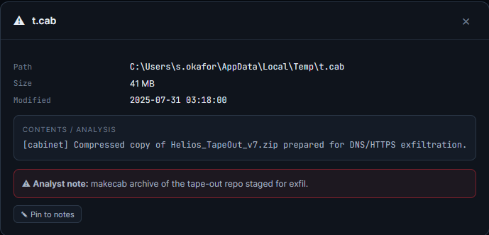
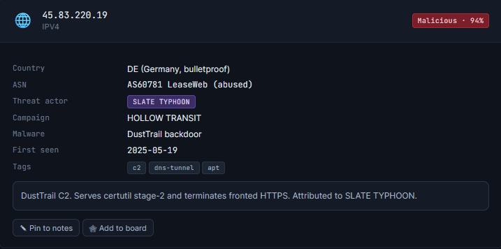

# Level 2: Hollow Transit

## 1. Which user account was the TRUE initial-access victim (patient zero)?
Looking at the case files, we can see that **s.okafor** is the true patient zero of this attack.  
  

## 2. What was the initial-access vector?
The initial access vector was an **unsigned DLL file** which was loaded and launched by a legitimate app. This information is available through the security logs section of the website.  
  

## 3. Which living-off-the-land binary (LOLBin) downloaded the second stage?
Looking at the same section of the website, we can see that **certutil.exe** is the LOLBin in question.  
  

## 4. What persistence technique was established?
Also in the same area is the **WMI filter**, which acts as the method of persistence for this attack.  
  

## 5. What domain was used for DNS-tunnelling C2?
In the same place is another alert containing the domain **3f9a2c.sync.telemetry-cdn.io**, which is the domain in question.  
  

## 6. What is the C2 IP address?
From the network interceptions, we can see that the C2 IP is **45.83.220.19**  
  

## 7. Which technique was used for lateral movement?
Back to the security logs, it can be clearly seen that lateral movement was done via **WinRM**  
  

## 8. What intellectual property was exfiltrated?
by navigating the filesystem to **C:\Users\s.okafor\AppData\Local\Temp\t.cab** we can see that the **tape-out archive** was staged and exfiltrated.  
  

## 9. The insider d.raymond looks suspicious. Are they responsible for the intrusion? (yes / no)
Given the evidence at hand, we can reasonably conclude that this employee was not responsible for the intrusion. 

## 10. Which threat actor is attributed to this intrusion?
A quick look at the threat intelligence tells us that **SLATE TYPHOON** is responsible for this attack. 
  
