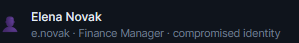
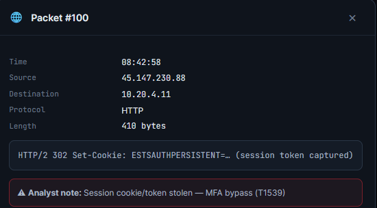
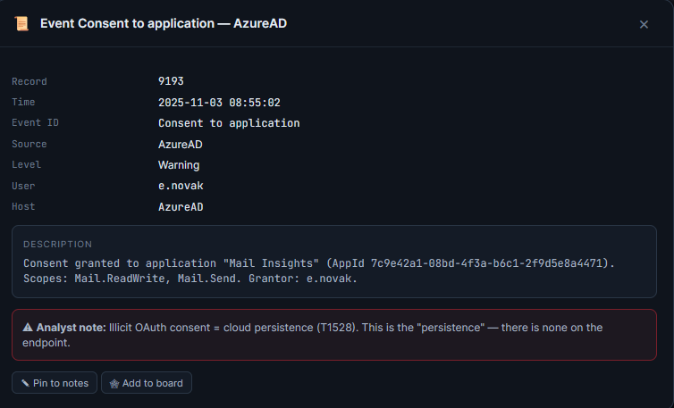
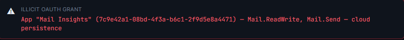
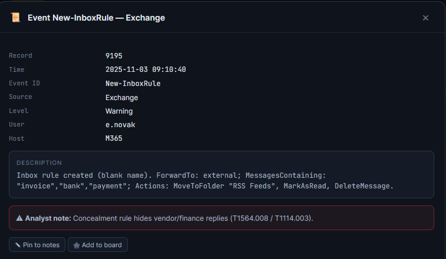
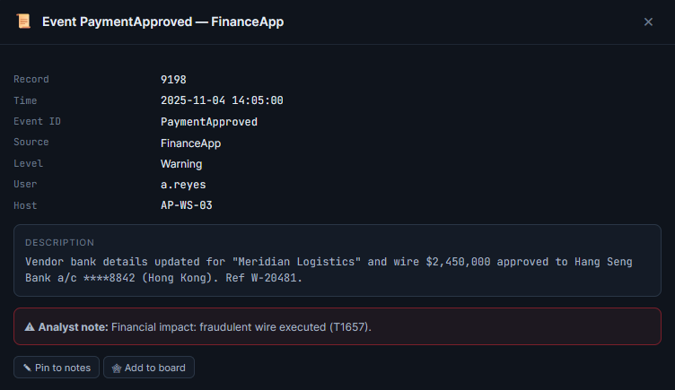
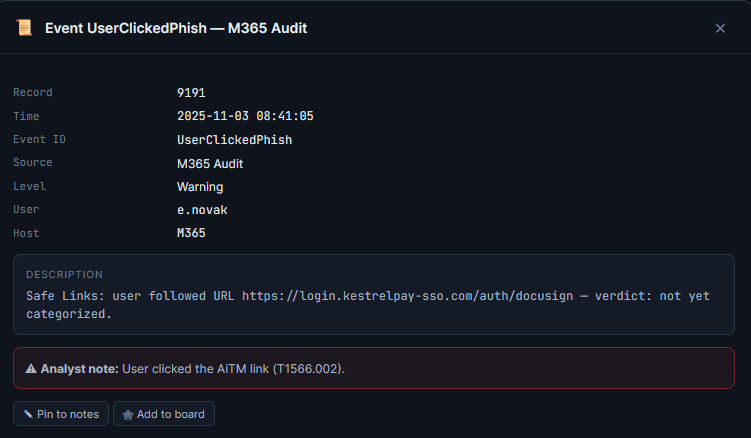
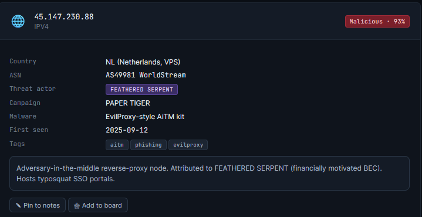

# Level 3: Glasshouse

## 1. Which user identity was compromised (patient zero)?
As is highlighted by the case files, **e.novak** is the compromised user.  
  

## 2. What technique bypassed MFA during initial access?
The technique employed here is to capture session tokens to force the MFA to give credentials to the threat actor.  
  

## 3. What provided persistence in the cloud identity plane?
In the event and audit logs we can see that they use the captured session tokens to set up **illict OAuth consent** so that they have a permanent way in.  
  

## 4. Which app permission scopes were abused for mailbox access + BEC?
In thesession and token forensics we can find an alert that identifies **Mail.ReadWrite and Mail.Send** as our permission scopes.  
  

## 5. What mailbox rule did the attacker use to conceal the fraud?
Back in the event and audit logs we find an alert that indicates a new mailbox rule was created. By looking at the specifications of the rule we can identify that it would be used to hide the messages for the fraud. the actual rule is **Inbox rule created (blank name). ForwardTo: external; MessagesContaining: "invoice","bank","payment"; Actions: MoveToFolder "RSS Feeds", MarkAsRead, DeleteMessage.**  
  

## 6. What was the ultimate fraudulent action (impact)?
In the same place we can see that a wire transfer for a large sum of money was made after changing the information for a vendor (presumably the account details to redirect the funds)  
  

## 7. Which vendor was impersonated in the payment-redirect fraud?
In the same alert as the previous question we can see that **Meridian Logistics** was the effected vendor.  
  

## 8. What is the AiTM phishing / proxy domain used for initial access?
In the network captures section we can find an alert that tells us that **login.kestrelpay-sso.com** resolves to the attacker proxy.  
  

## 9. From which country did the malicious sign-in originate?
A look at the threat intelligence tells us that this attack originated in **the Netherlands**  
  

## 10. The DBA d/p.hollis exported a customer database. Is that part of THIS intrusion? (yes / no)
As we've already established, the goal and action of this intrusion was a fraudulent wire transfer. Moreover, this user was not compromised by this threat actor.  

## 11. Logs contain a user-agent implicating "CRIMSON JACKAL". Should you attribute to them? (yes / no)
No, the vast majority of evidence points to a different threat actor. If anything, this other actor is either a red herring meant to throw investigators off or the ones responsible for the afformentioned customer database exfiltration.  

## 12. Which threat actor is ACTUALLY responsible?
By once again looking at the threat intelligence, we can see that **FEATHERED SERPENT** is actually responsible for this breach.  
  
